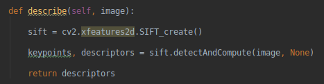

## Architecture logiciel
Le projet à été effectué sur ubuntu 18.04 avec python 3.6 et Opencv 3.3.0.

### Disclaimer

Le projet reprend l'architecture du projet ici :

Dans le dossier pyimagesearch/Matcher on pourra 
retrouver les classes utilisées
 pour effectuer la première partie du tp.

La Deuxième partie du tp (Visual Bag Of Word) se situe dans pyimagesearch/VBOW.

## Exigences
Les librairies nécessaires sont : 

	-opencv et opencv-contrib
	-numpy
	-matplotlib
	-flask

Il est nécessaire de placer les dossiers queries(contenant les images à requêter)
et le dossier mini_data (contenant le dataset sur lequel tester) sous le dossier
app/static.

##Conditions de tests
La construction d'un index (pour la partie 2) pour plus de 800 images
ayant pris plus de 5h, les deux parties ont été testé 
sur un dataset de 10 images.
 

#Partie I (Matcher
Pour le matcher, le principe à été de récupérer 
les descriptors de l'image à rechercher. Puis de les comparer 
aux descriptors des images présente dans le data set.

Pour cela, 

#Partie II (VBOW)

lien du github : https://github.com/maumauuu/CBIR-ImageRetrieval.git