## Architecture logiciel
Le projet à été effectué sur ubuntu 18.04 avec python 2.7 et Opencv 3.3.0.

### Disclaimer

Le projet reprend l'architecture du projet ici :
https://www.pyimagesearch.com/2014/12/08/adding-web-interface-image-search-engine-flask/

Dans le dossier **pyimagesearch/Matcher** on pourra 
retrouver les classes utilisées
 pour effectuer la première partie du tp.

La Deuxième partie du tp (Visual Bag Of Word) se situe dans **pyimagesearch/VBOW**.

## Exigences
Les librairies nécessaires sont : 

	-opencv et opencv-contrib
	-numpy
	-matplotlib
	-flask

Pour adapter l'interface web a une utilisation local, il est nécessaire de placer les dossiers **queries**(contenant les images à requêter)
et le dossier **mini_data** (contenant le dataset sur lequel tester) sous le dossier
**app/static**.

## Conditions de tests
La construction d'un index (pour la partie 2) pour plus de 800 images
ayant pris plus de 5h, les deux parties ont été testé 
sur un dataset de 10 images.
 

# Partie I (Matcher)

Pour le matcher, le principe a été de récupérer 
les descriptors de l'image à rechercher. Puis de les comparer 
aux descriptors des images présente dans le data set.

Pour cela, on utilise sift avec cv2.

Pour comparer les descriptors, on utilise la fonction **bf.knnMatch**.
On ajoute le résultat de tout ces résultat de toutes ces comparaisons dans
dans un dictionnaire (id de l'image, nombre de match interessant). 

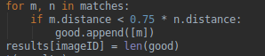

On trie ensuite ce dictionnaire dans une liste puis on en garde que ayant 
plus de 30 matchs avec l'image testé.

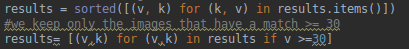

On peut retrouver l'implémentation complète du code dans la fonction **match** de la classe **Matcher**.

Pour lancer l'interface web :

    >python app/app_matcher.py
    
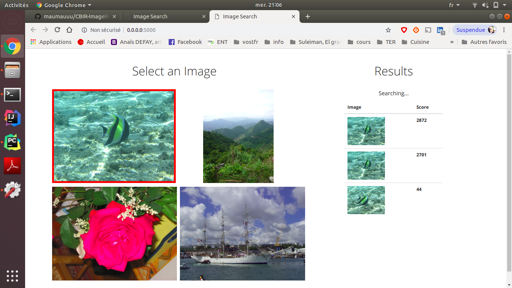
 
# Partie II (Visual Bag Of Words)

### Construction de l'index

Pour le VBOW, il a fallu tout d'abord construire un index contenant l'id de l'image, 
ainsi que la liste des ces labels.

Pour construire l'index, on calcul les descriptors de toutes les images du dataset 
et on les stocks dans une liste.

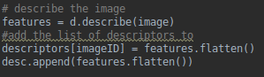

Ensuite on applique kmean sur toute la liste des descriptors afin d'obtenir 
les labels sur l'ensemble de nos images.

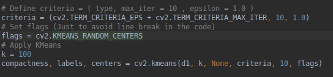

Maintenant qu'on a récupéré nos labels, on peut construire l'index. Pour cela, 
on va construire un dictionnaire { id de l'image : liste des labesl correspondant}.

Pour avoir la liste des labels d'une image (pour l'instant on ne possède qu'une liste de 
tous les labels de toutes les images) on va récupérer les **n** labels  qui
correspondent aux **n** descriptors de l'image, qu'on a enregistré dans un dictionnaire au tout début.

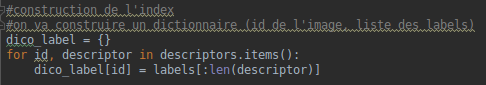

On sauvegarde ensuite l'index dans un fichier pour ne pas avoir à le 
recalculer à chaque fois qu'on lance le programme étant donné qu'il s'agit d'une
étape assez longue (cf. Conditions de tests)

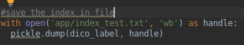

Pour lancer le calcul de l'index :

    > python app/pyimagesearch/kmeans.py

### Recherche des images

Pour rechercher une image, on commence par calculer son histogramme, 
avec sa liste de labels qu'on récupère dans l'index.

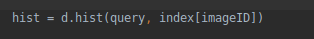

L'histogramme est donc un dictionnaire {numéro du cluster : 
 nombre d'occurences du cluster}.

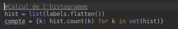

Ensuite, pour trouver les images intéressantes, on parcour l'index, on calcul les 
histogrammes de chaque image, puis on calcul la distance entre les deux histogrammes.

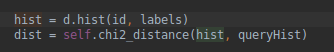

De la même manière que pour le matcher, on ne garde que les meilleures résultats :

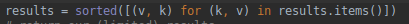

Pour lancer l'interface web :

    > python app/app.py
  
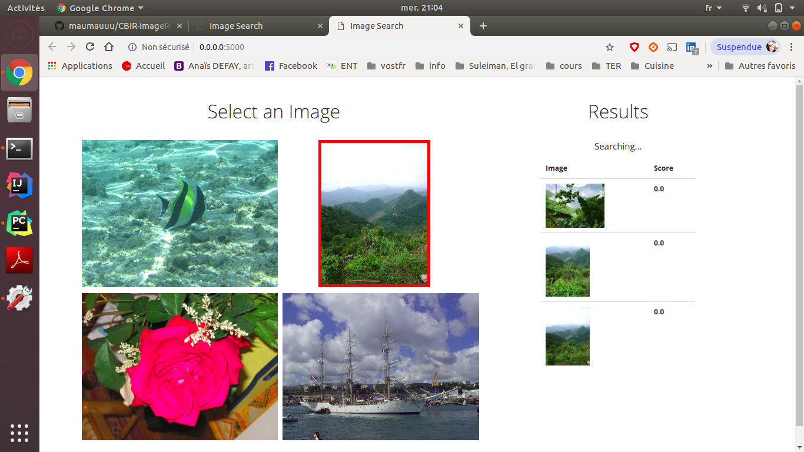 
    
### Inverted index

L'utilisation d'un index inversé, nous permet d'améliorer trés fortement les performances des recherches.
Il est construit sur la base d'un dictionnaire {numéro de cluster : liste des images}, la liste des
images étant les images pour lesquels ce cluster est significatif.

# Conclusion 

lien du github : https://github.com/maumauuu/CBIR-ImageRetrieval.git
